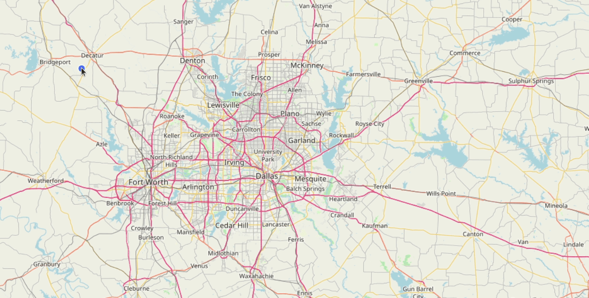

# OpenLayersDynamicMeasurement
Dynamic Measurement in OpenLayers with labels that follows changing geometry

## For tutorial post, click on following link 
[Create a DynamicMeasurement tool in OpenLayers to show measurements on labels that follow changing geometry](https://medium.com/random-gis-talks/create-a-dynamicmeasurement-tool-in-openlayers-to-show-measurements-on-labels-that-follows-cb9de8f15a86 "")
